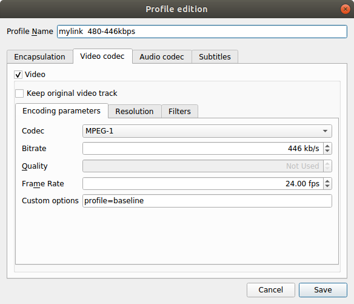
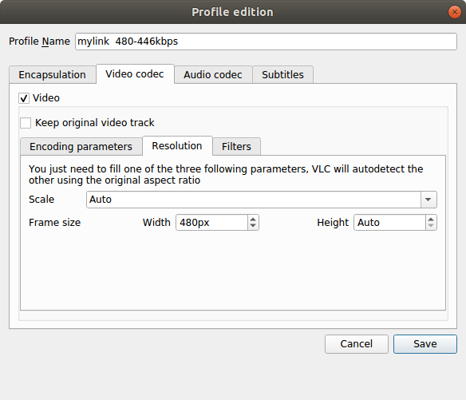
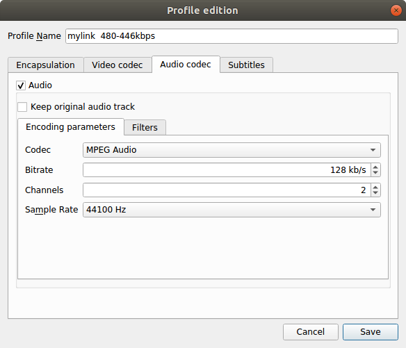
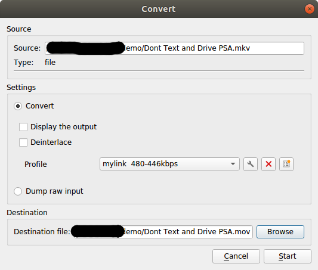
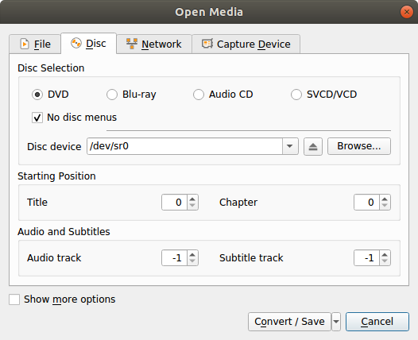

# How to play videos on the 2014+ Chevrolet Mylink

This procedure was tested on 2015 gm mylink.

Install vlcplayer, https://www.videolan.org/vlc/,  for your OS playform.   
Note: screenshots are on a Linux platform.  Windows users will use their normal pathing.

1. Open vlcplayer
2. Click Media Menu, select convert/save

3. Select file menu and locate media file, or select disc and if converting a disc.

4. Select Drop down button arrow at bottm and select convert.
5. Click third button next to Profile, create new profile

6. Enter a Profile Name, for example mylink.
7. On Encapsulation tab select Mp4/Mov

8. On Video tab select Video checkbox
9. Encoding Paremeters sub tab, select 
+ Codec: MPEG-1
+ Bitrate: 446 kb/s  (increasing bit rate doesn't result in any better quality when viewing on mylink screen, only larger files)
+ Frame Rate: 24.00 fps
+ Custom options: profile=baseline

10. Resolution sub tab select:
+ Scale: Auto
+ Frame size, width: 480px   Height: Auto    (I had mixed results increasing height, some videos wouldn't play)

11. Audio codec tab, select Audio checkbox

12. Encoding parameters subtab:
+ select MPEG Audio
+ Bitrate: 128 kb/s  (larger bit rates will result in larger ripped files)
+ Channels 2
+ Sample Rate: 44100 Hz
13. Click Save
14. Returns to Convert menu, click Browse and select your destination file location and name.  
+ Name the file is .mov extention or mylink won't recognize it as a video file.

15. Click start.
16. After file conversion copy file to USB drive for vehicle. 

Note:
I didn't see any file size limitations.  I was able to play multi gigabyte files without issues.

Enjoy 

## Troubleshooting
* Verify all profile settings shown above.
* Turn off looping mode in vlcplayer prior to converting files
* Make sure ripped file extension is .mov
* Unplug and plug USB drive while vehicle is running otherwise new media won't be recognized.   There is a GM Technote on this.
* After plugging in USB drive with fresh content give Infotainment some time to index new content.
* Videos will only play video while in Park, if you put vehicle in drive the screen will blank and audio only will continue.
* Use a high quality class 10 USB drive.
* If you followed procedure and videos still don't play or results in jitters, try a different usb drive.
* If ripping DVD's, select no disc menu from Open Media, Disc tab.

